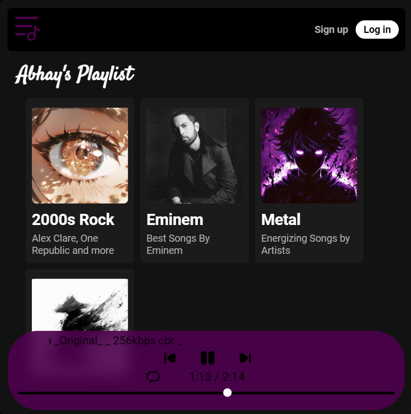

# 🎧 AkyuBeats

**AkyuBeats** is a sleek, responsive music streaming web app built with JavaScript, HTML5, and CSS3. It offers a smooth audio experience with custom controls, playlist management, and real-time progress tracking, optimized especially for mobile devices.

## 🚀 Features

- 🎼 **Custom Audio Player**  
  Built using the Web Audio API with queue management, volume control, and seek functionality.

- 📱 **Responsive Design**  
  Mobile-first layout using CSS Grid and Flexbox for seamless experience across devices.

- 🔁 **Playlist & Queue Management**  
  Add, remove, and reorder tracks easily.

- ⏱️ **Real-Time Progress Tracking**  
  Smooth and accurate playback timeline display.

- ⚡ **Performance Optimized**  
  Lightweight and responsive even on low-powered devices.

## 🛠 Tech Stack

- **HTML5** / **CSS3**  
- **JavaScript (Vanilla)**  
- **Web Audio API**  
- **CSS Grid & Flexbox**

## 📸 Screenshots

*Add screenshots here if available*

## 📂 Folder Structure

